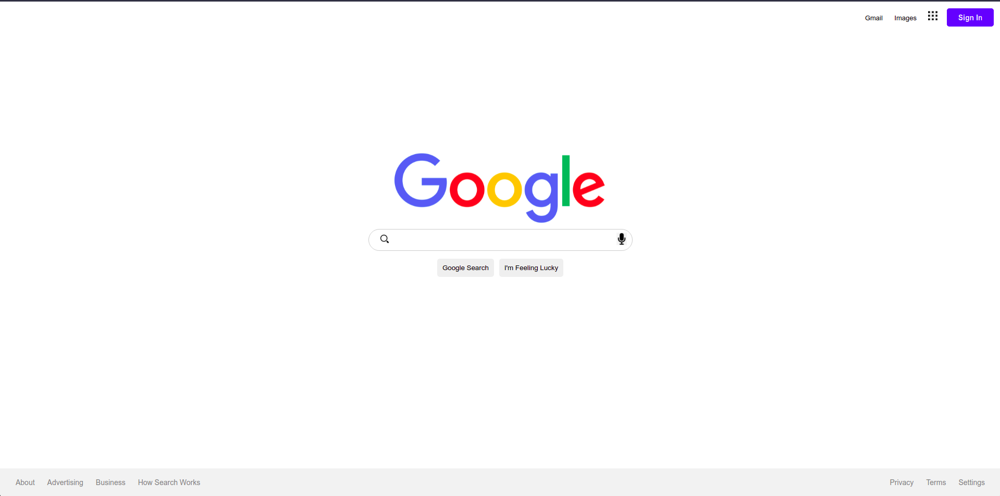

# Google Homepage

This challenge required using developer tools and basic HTML/CSS knowledge to recreate the Google Homepage from scratch.

## My challenges

    - The biggest challenge for me in this attempt was the behaviour of flexbox. I wasn't able to arrange the containers the way I was imagining them to work and had to, initially, *jugaad* a way to get it functioning. I asked around in the TOP Discord and a couple of the users helped me out enough that eventually I managed to get it working.
    - The other big challenge was the searchbox and placing the search and mic icons to the left and right of the input box, respectively. This required going through the source code of the Google homepage website to figure out how it was done and I managed to get it working.
    - The rest of the webpage - header, logo and footer - weren't all that hard to get done once I thought about it for a minute.

## Result

Ultimately, I'm happy with my first attempt. It looks decent enough if I say so myself. Obviously, there's still a lot that can be improved including the header and the search bar. But those are minor tweaks and not worth breaking my head over just yet.

